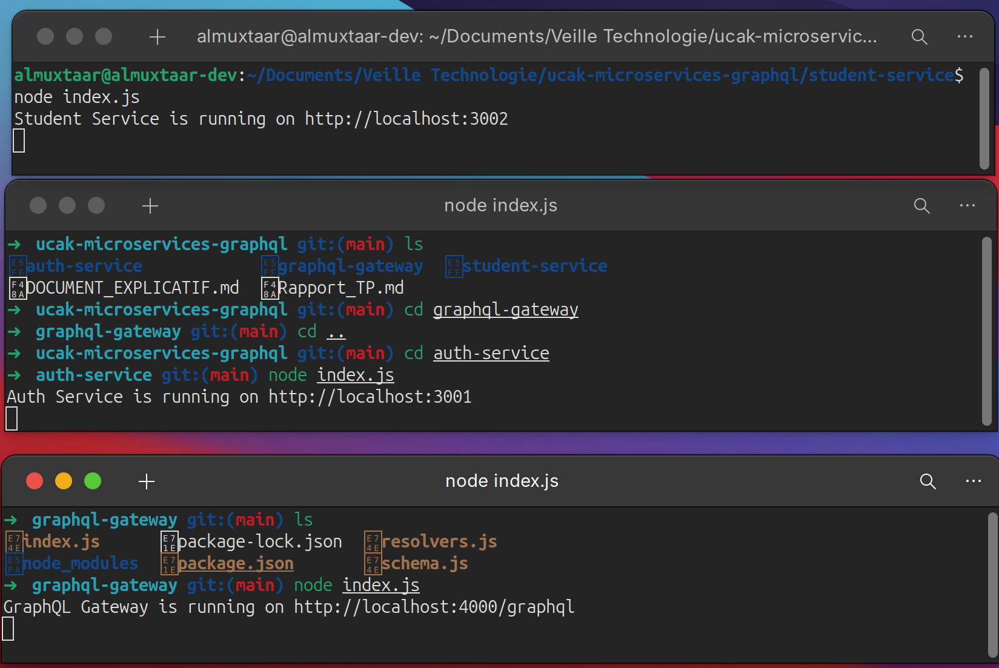
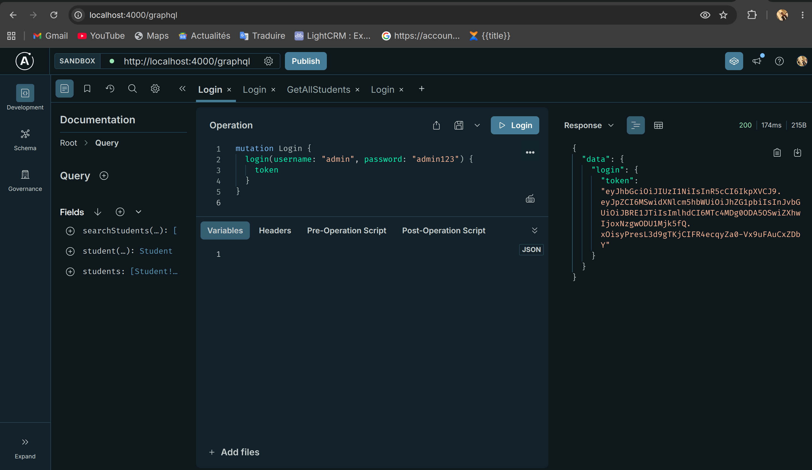
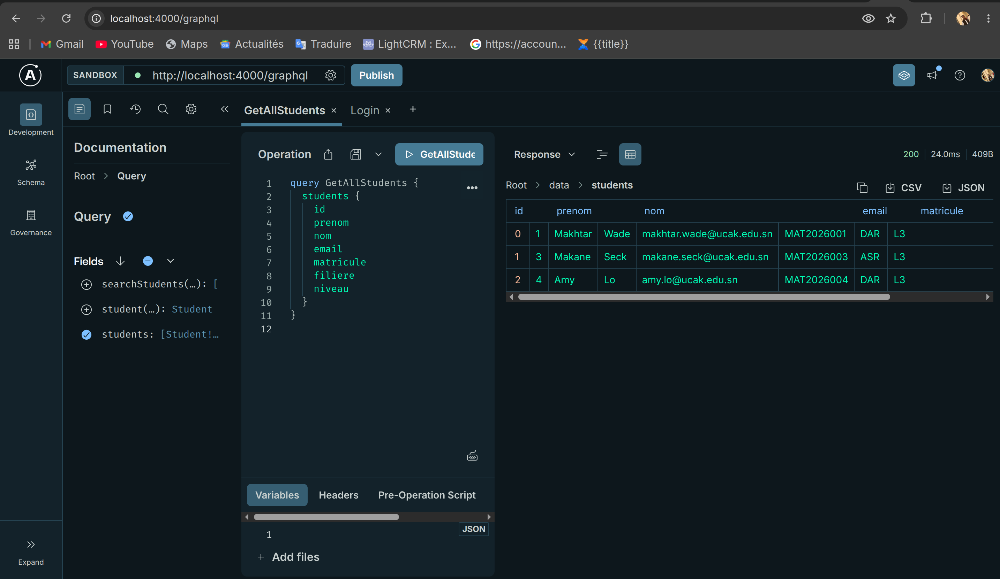
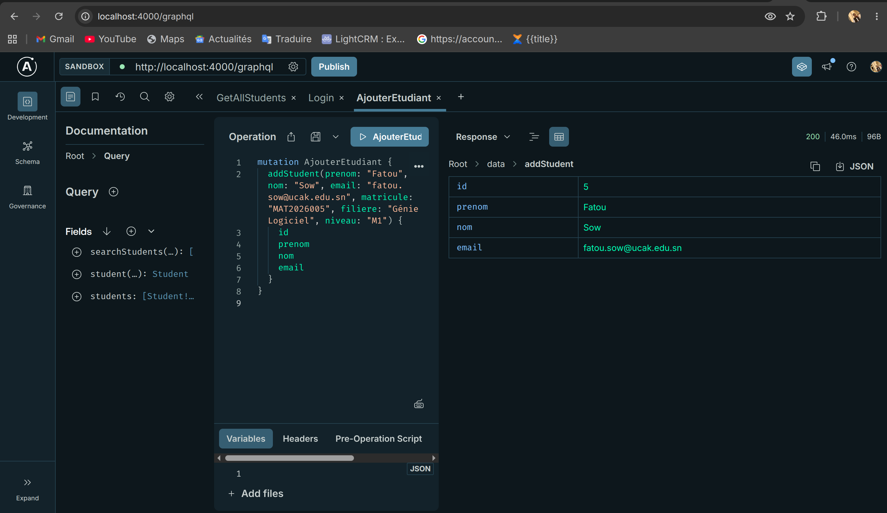

# Rapport de TP : Découverte de GraphQL et Introduction aux Microservices

## 1. Diagramme d'Architecture Globale

L'image ci-dessous illustre le flux de communication entre la passerelle GraphQL, le service d'authentification et le service métier :


---

## 2. Architecture du Système

Le projet repose sur une architecture orientée microservices composée de trois entités distinctes :

1. **Service d'Authentification (Port 3001)** : Microservice en charge de la validation des identifiants administrateur et de la génération des tokens JWT pour la sécurisation des échanges.
2. **Service des Étudiants (Port 3002)** : Microservice métier responsable des opérations CRUD (Création, Lecture, Mise à jour, Suppression) sur l'entité Étudiant.
3. **Passerelle (Gateway) GraphQL (Port 4000)** : Point d'entrée unique de l'architecture. Elle orchestre les requêtes, vérifie les autorisations d'accès (validation du token JWT) et relaie les requêtes vers le Service des Étudiants.

---

## 2. Procédure de Déploiement Local

L'initialisation de l'application nécessite l'exécution simultanée des trois services. Il est recommandé d'utiliser des terminaux distincts.

**Service d'Authentification :**
```bash
cd "ucak-microservices-graphql/auth-service"
node index.js
```

**Service des Étudiants :**
```bash
cd "ucak-microservices-graphql/student-service"
node index.js
```

**Passerelle GraphQL :**
```bash
cd "ucak-microservices-graphql/graphql-gateway"
node index.js
```



---

## 3. Validation Fonctionnelle (Tests)

Les tests suivants permettent de valider le bon fonctionnement de l'API GraphQL via l'interface Apollo Sandbox, accessible à l'adresse : `http://localhost:4000/graphql`.

### 3.1. Authentification de l'Administrateur

L'authentification est un prérequis pour l'exécution des requêtes protégées.
**Requête (Mutation) :**
```graphql
mutation Login {
  login(username: "admin", password: "admin123") {
    token
  }
}
```
**Résultat attendu :** Retourne un token JWT valide.


### 3.2. Configuration de l'En-tête d'Autorisation

Pour autoriser les appels suivants, le token récupéré doit être inséré dans les en-têtes HTTP de la requête client :
- **Clé :** `Authorization`
- **Valeur :** `Bearer <VOTRE_TOKEN>`

### 3.3. Récupération de la Liste des Étudiants

**Requête (Query) :**
```graphql
query GetAllStudents {
  students {
    id
    prenom
    nom
    email
    matricule
    filiere
    niveau
  }
}
```
**Résultat attendu :** Retourne le tableau contenant l'ensemble des étudiants.


### 3.4. Ajout d'un Nouvel Étudiant

**Requête (Mutation) :**
```graphql
mutation AjouterEtudiant {
  addStudent(prenom: "Fatou", nom: "Sow", email: "fatou.sow@ucak.edu.sn", matricule: "MAT2026005", filiere: "Génie Logiciel", niveau: "M1") {
    id
    prenom
    nom
    email
  }
}
```
**Résultat attendu :** Confirme la création de l'étudiant avec l'ID correspondant.


### 3.5. Mise à Jour d'un Étudiant

**Requête (Mutation) :**
```graphql
mutation ModifierEtudiant {
  updateStudent(id: "5", prenom: "Fatou", nom: "Sow", email: "fatou.nouvel_email@ucak.edu.sn", matricule: "MAT2026005", filiere: "Génie Logiciel", niveau: "M1") {
    id
    email
  }
}
```
**Résultat attendu :** Confirme la modification des champs spécifiés.

### 3.6. Recherche par Paramètre (Variables GraphQL)

**Requête (Query) :**
```graphql
query ChercherEtudiant($texteRecherche: String!) {
  searchStudents(q: $texteRecherche) {
    id
    prenom
    nom
    email
  }
}
```
**Variables :**
```json
{
  "texteRecherche": "Makane"
}
```
**Résultat attendu :** Retourne uniquement les entités correspondant à la chaîne de caractères.

### 3.7. Suppression d'un Étudiant

**Requête (Mutation) :**
```graphql
mutation SupprimerEtudiant {
  deleteStudent(id: "5") {
    id
    prenom
    nom
  }
}
```
**Résultat attendu :** Confirme la suppression et retourne les informations de l'étudiant supprimé.

### 3.8. Suppression Multiple d'Étudiants (Par lot)

**Requête (Mutation) :**
```graphql
mutation SupprimerPlusieursEtudiants {
  deleteStudents(ids: ["1", "3"]) {
    message
    deletedCount
  }
}
```
**Résultat attendu :** Retourne un message récapitulatif avec le nombre d'étudiants effectivement supprimés.


---


## 4. Conclusion : Justification Technique de l'Architecture

* **Optimisation de la bande passante (GraphQL)** : GraphQL élimine les problématiques d'Over-fetching et d'Under-fetching en permettant au client de requêter avec précision la structure des données désirée.
* **Point d'entrée centralisé** : L'API expose un unique endpoint (`/graphql`), masquant ainsi la complexité du réseau sous-jacent à l'application cliente.
* **Résilience et Scalabilité (Microservices)** : La séparation physique des composants (Auth et Student) isole les pannes éventuelles et offre la possibilité de mettre à l'échelle uniquement le service en surcharge (par exemple, le Student Service lors des périodes d'inscription massives).
